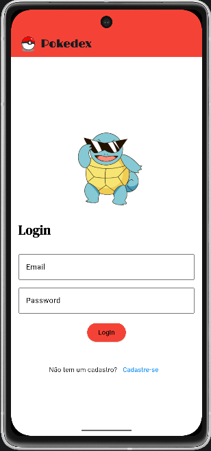
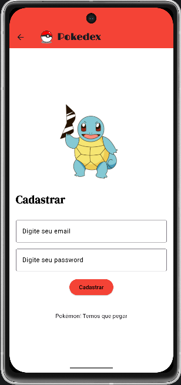
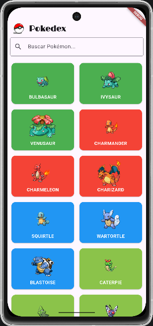
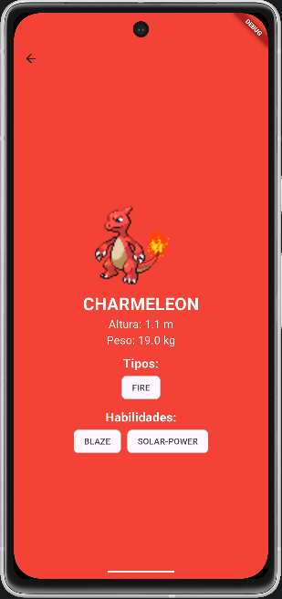

# 📱 Pokédex App (Flutter)

Aplicativo mobile desenvolvido em **Flutter** com integração ao **Firebase Authentication** e consumo da **PokéAPI**.

---

## 🚀 Funcionalidades

* 🔐 Cadastro e login de usuários com Firebase
* 🔎 Busca de Pokémons
* 📋 Listagem dos Pokémons (API)
* 📄 Tela de detalhes com:

    * Nome
    * Tipo
    * Peso
    * Altura
    * Habilidades

---

## 🧱 Arquitetura da Aplicação

A aplicação segue uma estrutura simples baseada em separação por responsabilidades:

```
lib/
├── main.dart                # Ponto de entrada do app
├── firebase_options.dart    # Configurações do Firebase
└── pages/
    ├── login_page.dart      # Tela de login
    ├── register_page.dart   # Tela de cadastro
    └── pokedex.dart         # Tela dos pokemons
```

### 🔄 Fluxo da aplicação

```
Usuário
→ Login/Register
    → Firebase Auth
        → Pokedex
            → API (PokéAPI)
```

---

## 🛠️ Tecnologias utilizadas

* Flutter
* Dart
* Firebase Authentication
* HTTP (consumo de API)
* PokéAPI ([https://pokeapi.co](https://pokeapi.co))

---

## ▶️ Como executar o projeto

### 📌 Pré-requisitos

* Flutter instalado
* Android Studio ou VS Code
* Emulador Android ou dispositivo físico

---

### ⚙️ Passos

```bash
# Clonar o repositório
git clone https://github.com/felipematsukuma/pokedex-api.git

# Entrar na pasta
cd pokedex-api

# Instalar dependências
flutter pub get

# Rodar o projeto
flutter run
```

---

## 🔥 Configuração do Firebase

1. Criar projeto no Firebase
2. Adicionar app Android
3. Baixar arquivo:

```bash
android/app/google-services.json
```

4. Ativar Authentication (Email/Senha)

---

## 📸 Prints da Aplicação

| Login | Registrar | Página inicial | Pokemon |
| :-: | :-: | :-: | :-: |
 |  |  | 

---

## 📄 Licença

Este projeto é apenas para fins educacionais.
